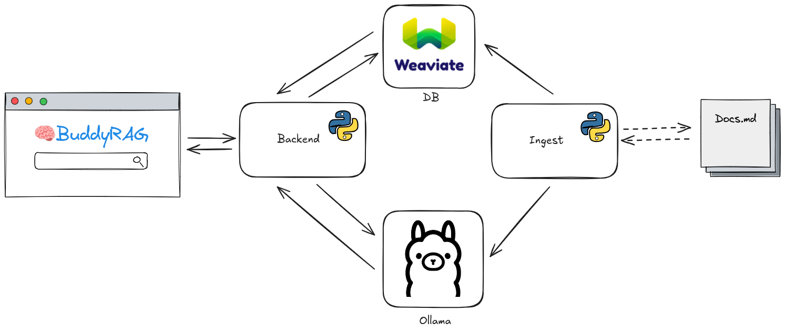

# 🧠 BuddyRAG – RAG Chatbot for Markdown Documents

Tired of searching for information in your Obsidian vault (or something like that)?  
Me too. That’s why I built this!

Welcome to **BuddyRAG** – an AI-powered RAG chatbot that lets you **upload a Markdown (`.md`) document** and interactively **chat with it** through a simple web interface.

---

## 🚀 Features

- 💬 **Conversational Interface**: Ask questions and get contextual answers from your uploaded `.md` file.
- ⚙️ **Runs Locally**: Hosted on `http://localhost:8501` using [Streamlit](https://streamlit.io/) – no cloud setup required.
- 🧠 **RAG Architecture**: Uses Retrieval-Augmented Generation to provide accurate, document-grounded responses.
- 🧠 **Customizable Models**: Choose your preferred embedding and LLM models via the `docker-compose.yml` file. Defaults:
  - LLM model: `llama3`
  - Embedding model: `nomic-embed-text`

---

## ✏️ BuddyRAG Architecture



---

## 📦 How It Works

1. **Upload a `.md` file**: Place your file into the `input_files` folder. They will be added to weaviate.
2. The chatbot **ingests the document** and builds a searchable knowledge base.
3. You can now **ask questions** and receive answers directly from the content of your file.

---

## 🖥️ Getting Started

### Installation

First, clone the project (`git clone`)

Then, start the Docker container:

```bash
docker compose up -d
```
Open your browser and go to:
```
http://localhost:8501
```

## 🧪 Tested Specs
Tested on a standard machine (baseline specs):

- CPU: Intel(R) Core(TM) i5-8350U @ 1.70GHz

- RAM: 16 GB

- Disk: ≥ 20 GB
